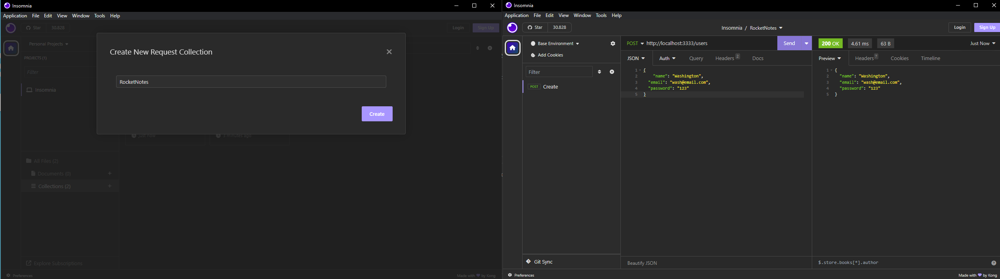
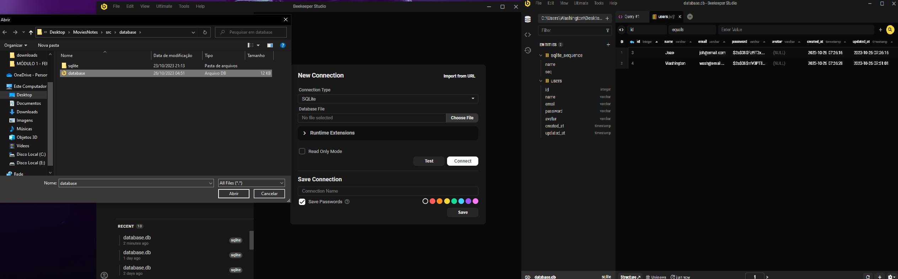

<h1 align="center"> RocketNotes </h1>

Project created in Rocketseat's Explorer course to create user notes.

  <a href="#floppy_disk-technologies">Technologies</a>&nbsp;&nbsp;&nbsp;|&nbsp;&nbsp;&nbsp;
  <a href="#toolbox-tools">Tools</a>&nbsp;&nbsp;&nbsp;|&nbsp;&nbsp;&nbsp;
  <a href="#package-package">Package</a>&nbsp;&nbsp;&nbsp;|&nbsp;&nbsp;&nbsp;
  <a href="#rocket-project">Project</a>&nbsp;&nbsp;&nbsp;|&nbsp;&nbsp;&nbsp;
  <a href="#memo-licença">
License</a>

  

 

## :floppy_disk: Technologies
- <a href="https://developer.mozilla.org/pt-BR/docs/Web/JavaScript" target="_blank">JavaScript</a>
- <a href="https://nodejs.org/en" target="_blank">Node.js</a>
- <a href="https://git-scm.com/" target="_blank">Git</a> e <a href="https://github.com/" target="_blank">GitHub</a>

## :toolbox: Tools
- <a href="https://code.visualstudio.com/" target="_blank">Visual Studio Code</a>
- <a href="https://insomnia.rest/download" target="_blank">Insomnia</a>
- <a href="https://www.beekeeperstudio.io/" target="_blank">Beekeeper Studio Ultimate</a>

## 	:package: Package
- <a href="https://expressjs.com/pt-br/" target="_blank">Express</a>
- <a href="https://github.com/davidbanham/express-async-errors" target="_blank">Express async errors</a>
- <a href="https://github.com/remy/nodemon#nodemon" target="_blank">Nodemon</a>
- <a href="https://www.npmjs.com/package/sqlite#installation" target="_blank">SQLite and SQLite3</a>
- <a href="https://www.npmjs.com/package/bcrypt" target="_blank">Bcrypt</a>
- <a href="https://knexjs.org/guide/" target="_blank">Knex</a>
## :rocket: Project

Using the Insomnia tool to create the routes.

We created a folder (utils) with a file (AppError.js) for handling exceptions, using the Middleware concept.

Using sqlite database, to create a database.db file when connecting to the server. And to view the created table we will use Bekeeper.

We will use the bcrypt package to encrypt passwords.

## :memo: Licença

This project is under the MIT license.

---